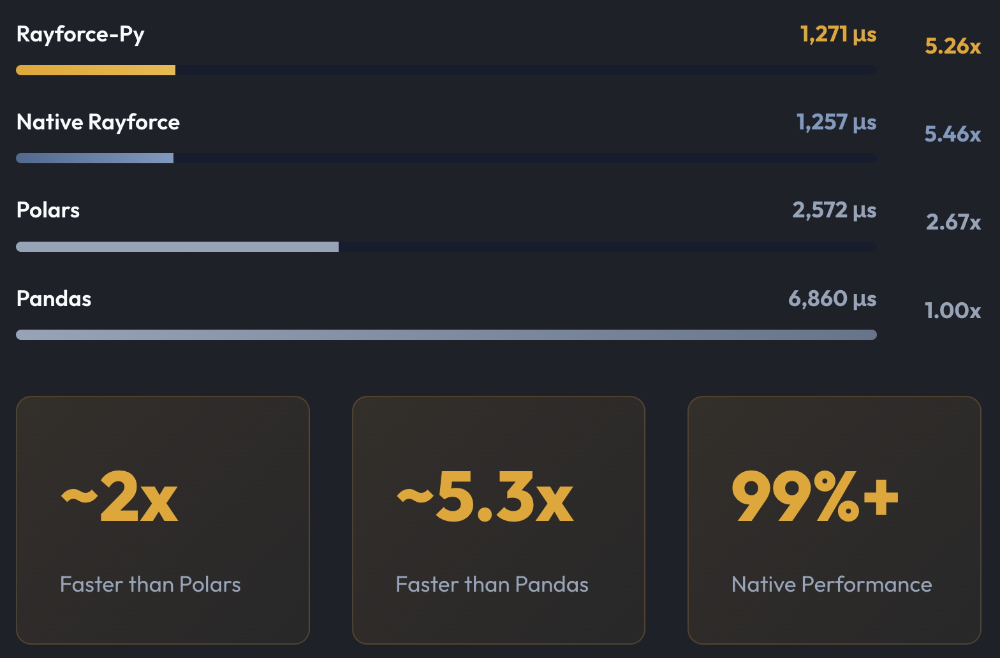

# ⚡ High-Performance Python Interface for [RayforceDB](https://github.com/RayforceDB/rayforce)

 [](soon) [](soon) [](https://github.com/RayforceDB/rayforce-py/releases)


## Features

- **Pythonic API** - Chainable, fluent query syntax that feels pythonic
- **High Performance** - Minimal overhead between Python and RayforceDB runtime thanks to C API usage
- **Active Development** - Continuously expanding functionality





## 🚀 Quick Start

```python
>>> from datetime import time
>>> from rayforce import Table, Vector, Symbol, Time, F64
>>> from rayforce.types.table import Column

>>> quotes = Table.from_dict({
        "symbol": Vector(items=["AAPL", "AAPL", "AAPL", "GOOG", "GOOG", "GOOG"], ray_type=Symbol),
        "time": Vector(
            items=[
                time.fromisoformat("09:00:00.095"),
                time.fromisoformat("09:00:00.105"),
                time.fromisoformat("09:00:00.295"),
                time.fromisoformat("09:00:00.145"),
                time.fromisoformat("09:00:00.155"),
                time.fromisoformat("09:00:00.345"),
            ],
            ray_type=Time,
        ),
        "bid": Vector(items=[100.0, 101.0, 102.0, 200.0, 201.0, 202.0], ray_type=F64),
        "ask": Vector(items=[110.0, 111.0, 112.0, 210.0, 211.0, 212.0], ray_type=F64),
    })

>>> result = (
        quotes
        .select(
            max_bid=Column("bid").max(),
            min_bid=Column("bid").min(),
            avg_ask=Column("ask").mean(),
            records_count=Column("time").count(),
            first_time=Column("time").first(),
        )
        .where((Column("bid") >= 110) & (Column("ask") > 100))
        .by("symbol")
        .execute()
    )
>>> print(result)
┌────────┬─────────┬─────────┬─────────┬───────────────┬──────────────┐
│ symbol │ max_bid │ min_bid │ avg_ask │ records_count │ first_time   │
├────────┼─────────┼─────────┼─────────┼───────────────┼──────────────┤
│ GOOG   │ 202.00  │ 200.00  │ 211.00  │ 3             │ 09:00:00.145 │
├────────┴─────────┴─────────┴─────────┴───────────────┴──────────────┤
│ 1 rows (1 shown) 6 columns (6 shown)                                │
└─────────────────────────────────────────────────────────────────────┘
```

## 📦 Installation

Package is available on [Pypi](https://pypi.org/project/rayforce-py/0.0.13/)
```bash
pip install rayforce-py
```

This will also add a handy command to call native Rayforce runtime from anywhere:
```clj
~ $ rayforce
Launching Rayforce...
  RayforceDB: 0.1 Dec  6 2025
  Documentation: https://rayforcedb.com/
  Github: https://github.com/RayforceDB/rayforce
↪ (+ 1 2)
3
```

**Full documentation available at:** https://py.rayforcedb.com/

---

**Built with ❤️ for high-performance data processing**
